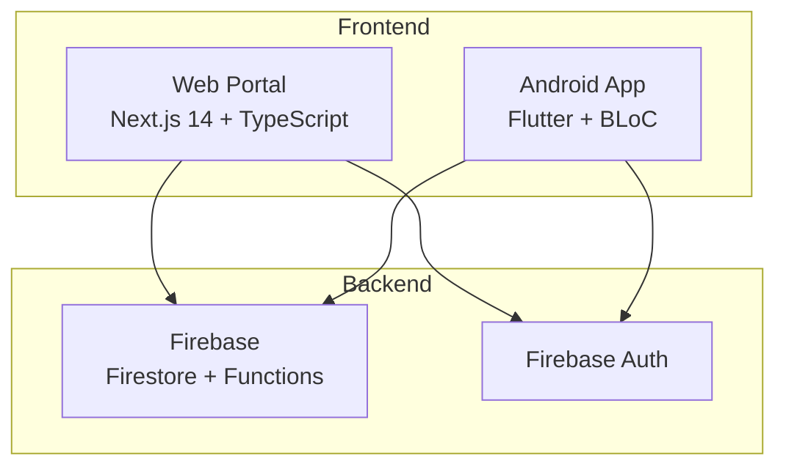

# DhruvRAG: iConnect System Architecture

> **Purpose:** Centralized knowledge base for the iConnect system architecture, services, and changelog.

## 1. System Overview

iConnect is a **constituent management platform** for political leaders, consisting of:



---

## 2. Web Portal Architecture

**Path:** `/iconnect-web/src/`

### 2.1 Page Structure (`app/(dashboard)/`)
| Page | Description | Key Components |
|------|-------------|----------------|
| `upload/` | Data Entry & CSV Upload | `DataMetricsCard`, `ValidatedDateInput` |
| `meeting/` | Conference Call Broadcast | Ticker creation, Bridge provisioning |
| `scheduler/` | Calendar + Daily Events + Festivals | `GlassCalendar`, Festival Manager |
| `settings/` | User preferences | Language, Notifications |

### 2.2 Services (`lib/services/`)
| Service | Functions |
|---------|-----------|
| `meeting.ts` | `createMeetingTicker`, `createConferenceBridge`, `endMeetingTicker`, `subscribeToTicker` |
| `constituents.ts` | `addConstituent`, `getConstituents`, `searchConstituents`, `getConstituentsForDate` |
| `metrics.ts` | `fetchConstituentMetrics`, `fetchGPMetricsForBlock` |
| `festivals.ts` | `addFestival`, `deleteFestival`, `getUpcomingFestivals` |
| `messaging.ts` | SMS/WhatsApp broadcast functions |

### 2.3 UI Components (`components/ui/`)
| Component | Purpose |
|-----------|---------|
| `ValidatedDateInput` | DD/MM/YYYY input with calendar, real-time validation (red/green borders) |
| `GlassCalendar` | Liquid Glass calendar with event dots |
| `DataMetricsCard` | Total count + Block/GP breakdown with interactive hover |

---

## 3. Android App Architecture

**Path:** `/lib/features/`

### 3.1 Feature Modules (Clean Architecture)
```
features/
├── action/          # Today Tab - Send SMS/Call/WhatsApp
├── auth/            # Firebase Authentication
├── home/            # Dashboard
├── meetings/        # Meeting management
├── report/          # History Tab
├── settings/        # Preferences
├── tasks/           # Task management
└── ticker/          # Meeting Ticker display
```

### 3.2 Ticker Feature (`features/ticker/`)
**Entity:** `MeetingTicker`
- `title`, `startTime`, `meetUrl`, `status`
- `meetingType` (VIDEO_MEET | CONFERENCE_CALL)
- `dialInNumber`, `accessCode`

**Bloc States:** `TickerInitial` → `TickerActive` | `TickerEmpty`

### 3.3 Action Feature (`features/action/`)
- **AiGreetingSheet:** Gemini-powered greeting generation
- **Action persistence:** SMS/Call/WhatsApp button states

---

## 4. Firebase Backend

### 4.1 Collections
| Collection | Purpose |
|------------|---------|
| `constituents` | Voter data with DOB, anniversary, mobile, ward, block, GP/ULB |
| `active_tickers` | Live meeting broadcasts (keyed by leaderUid) |
| `festivals` | Custom + default festivals |

### 4.2 Cloud Functions (`functions/src/`)
| Function | Trigger | Purpose |
|----------|---------|---------|
| `createMeetingTicker` | HTTPS Callable | Create ticker document + trigger notifications |
| `createConferenceBridge` | HTTPS Callable | Provision dial-in number + access code |

---

## 5. Date Input Validation Standard

All date fields use `ValidatedDateInput` with:
- **Format:** DD/MM/YYYY (Indian format)
- **Auto-masking:** Automatic slash insertion
- **Validation:** Red border + (!) for invalid, Green border + (✓) for valid
- **Edge cases:** Leap year, month-specific day limits

**Current usage:**
- ✅ DOB (upload page)
- ✅ Anniversary (upload page)
- ✅ Meeting Date (meeting page)
- ✅ Festival Date (scheduler page)

---

## 6. Test Infrastructure

### 6.1 Web Tests (`iconnect-web/src/__tests__/`)
| Test File | Coverage |
|-----------|----------|
| `metrics.test.ts` | `fetchConstituentMetrics`, `fetchGPMetricsForBlock` |
| `constituents.test.ts` | Constituent CRUD operations |
| `ValidatedDateInput.test.tsx` | Date input auto-masking, validation |
| `upload-form.test.tsx` | Form field order, validation |

### 6.2 Android Tests (`test/features/`)
- Widget tests per feature
- Bloc tests for state management

---

## 7. Changelog

### 2025-12-17
- **Date Field Consistency:** Updated Festival Date in scheduler to use `ValidatedDateInput`
- **Archived:** Deprecated old `festivals/page.tsx` to `_deprecated/`
- **CSV Validation:** Added `validateCsvRow`, `validateCsvData` for upload validation
- **DOB/Anniversary Validation:** Added `validateConstituentDates` requiring at least one date

### 2024-12-15
- **Meeting Page:** "Liquid Glass" redesign with Conference Call mode
- **Ticker Integration:** Real-time ticker subscription via Firestore

### 2024-12-12
- **Scheduler Page:** 3-column layout (Calendar, Daily Events, Festivals)
- **GlassCalendar:** Event dot indicators for birthdays/anniversaries/festivals
