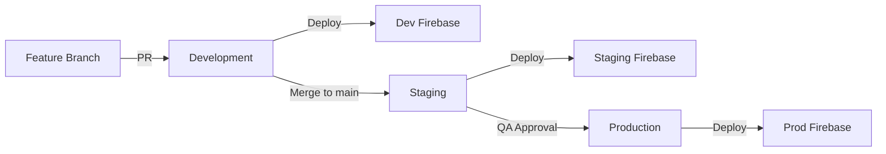

# Multi-Environment Setup Guide

> **Version**: 1.0.0  
> **Last Updated**: 2025-12-17

---

## Overview

This guide documents the process for setting up separate Firebase projects for development, staging, and production environments.

---

## Environment Strategy

| Environment | Purpose | Data | Users |
|-------------|---------|------|-------|
| **Development** | Local dev + testing | Synthetic/seed data | Developers |
| **Staging** | Pre-prod validation | Anonymized prod data | QA + Stakeholders |
| **Production** | Live users | Real PII data | End users |

---

## Step 1: Create Firebase Projects

### Via Firebase Console

1. **Development**
   - Project ID: `iconnect-dev`
   - Location: `asia-south1`
   - Enable: Authentication, Firestore, Functions, Storage

2. **Staging**
   - Project ID: `iconnect-staging`
   - Location: `asia-south1`
   - Enable: Authentication, Firestore, Functions, Storage

3. **Production**
   - Project ID: `iconnect-prod`
   - Location: `asia-south1`
   - Enable: Authentication, Firestore, Functions, Storage, Analytics

### Via CLI

```bash
# Create projects
firebase projects:create iconnect-dev --display-name="iConnect Development"
firebase projects:create iconnect-staging --display-name="iConnect Staging"
firebase projects:create iconnect-prod --display-name="iConnect Production"

# Link to GCP
gcloud projects create iconnect-dev --set-as-default
gcloud projects create iconnect-staging
gcloud projects create iconnect-prod
```

---

## Step 2: Configure Firebase Projects

### Initialize Each Project

```bash
# Development
firebase use --add iconnect-dev
firebase alias dev

# Staging
firebase use --add iconnect-staging
firebase alias staging

# Production
firebase use --add iconnect-prod
firebase alias prod
```

### Deploy Firestore Rules & Indexes

```bash
# Development (relaxed for testing)
firebase use dev
firebase deploy --only firestore:rules,firestore:indexes

# Staging (production rules)
firebase use staging
firebase deploy --only firestore:rules,firestore:indexes

# Production
firebase use prod
firebase deploy --only firestore:rules,firestore:indexes
```

---

## Step 3: Mobile App Configuration

### Generate Firebase Config Per Environment

```bash
# Install FlutterFire CLI
dart pub global activate flutterfire_cli

# Development
flutterfire configure --project=iconnect-dev --out=lib/firebase_options_dev.dart

# Staging
flutterfire configure --project=iconnect-staging --out=lib/firebase_options_staging.dart

# Production
flutterfire configure --project=iconnect-prod --out=lib/firebase_options.dart
```

### Update `lib/main.dart`

```dart
import 'package:flutter/foundation.dart';
import 'firebase_options.dart';
import 'firebase_options_dev.dart';
import 'firebase_options_staging.dart';

Future<void> main() async {
  WidgetsFlutterBinding.ensureInitialized();
  
  // Environment-specific Firebase initialization
  FirebaseOptions options;
  if (kReleaseMode) {
    options = DefaultFirebaseOptions.currentPlatform; // Production
  } else {
    const env = String.fromEnvironment('ENV', defaultValue: 'dev');
    options = env == 'staging' 
        ? DefaultFirebaseOptionStaging.currentPlatform 
        : DefaultFirebaseOptionsDev.currentPlatform;
  }
  
  await Firebase.initializeApp(options: options);
  runApp(const MyApp());
}
```

### Build Commands

```bash
# Development
flutter build apk --debug

# Staging
flutter build apk --release --dart-define=ENV=staging

# Production
flutter build appbundle --release
```

---

## Step 4: Web Portal Configuration

### Environment Variables

Create separate `.env` files:

**`.env.development`**
```bash
NEXT_PUBLIC_FIREBASE_PROJECT_ID=iconnect-dev
NEXT_PUBLIC_FIREBASE_API_KEY=<dev-key>
NEXT_PUBLIC_FIREBASE_AUTH_DOMAIN=iconnect-dev.firebaseapp.com
```

**`.env.staging`**
```bash
NEXT_PUBLIC_FIREBASE_PROJECT_ID=iconnect-staging
NEXT_PUBLIC_FIREBASE_API_KEY=<staging-key>
NEXT_PUBLIC_FIREBASE_AUTH_DOMAIN=iconnect-staging.firebaseapp.com
```

**`.env.production`**
```bash
NEXT_PUBLIC_FIREBASE_PROJECT_ID=iconnect-prod
NEXT_PUBLIC_FIREBASE_API_KEY=<prod-key>
NEXT_PUBLIC_FIREBASE_AUTH_DOMAIN=iconnect-prod.firebaseapp.com
```

### Vercel Configuration

**Development Branch** → `iconnect-dev`
**Staging Branch** → `iconnect-staging`
**Production Branch** → `iconnect-prod`

Set environment variables in Vercel dashboard for each deployment.

---

## Step 5: Cloud Functions Deployment

### Deploy to Each Environment

```bash
# Development (with debug logging)
firebase use dev
firebase deploy --only functions

# Staging (production config, test data)
firebase use staging
firebase deploy --only functions

# Production (strict config)
firebase use prod
firebase deploy --only functions
```

### Environment-Specific Configuration

```bash
# Set function config per environment
firebase use dev
firebase functions:config:set gemini.api_key="dev-key"

firebase use staging
firebase functions:config:set gemini.api_key="staging-key"

firebase use prod
firebase functions:secrets:set GEMINI_API_KEY  # Use Secret Manager
```

---

## Step 6: Data Migration (Staging Only)

### Anonymize Production Data

```bash
# Export production data
gcloud firestore export gs://iconnect-prod-backup/$(date +%Y%m%d)

# Anonymize (custom script)
node scripts/anonymize-data.js \
  --input=gs://iconnect-prod-backup/20251217 \
  --output=gs://iconnect-staging-data/anonymized

# Import to staging
gcloud firestore import gs://iconnect-staging-data/anonymized \
  --project=iconnect-staging
```

### Anonymization Rules

- **PII Fields**: Hash or replace
  - `mobile_number` → `+91XXXXXXXXXX`
  - `name` → `User_<hash>`
  - `address` → `<block>, <gp>`
- **Preserve**: Ward, GP, Block, timestamps
- **Clear**: Action logs, messages

---

## Step 7: Monitoring & Alerts

### Per-Environment Dashboards

**Development**: Error tracking only  
**Staging**: Performance + error tracking  
**Production**: Full monitoring (Crashlytics, Analytics, SLOs)

### Alert Routing

- **Dev**: Console only
- **Staging**: Slack channel
- **Production**: PagerDuty + Slack

---

## Promotion Workflow



**Steps:**
1. Develop on feature branch → Auto-deploy to dev
2. Merge to `main` → Auto-deploy to staging
3. QA approval → Manual deploy to production
4. Tag release → `git tag v1.6.0`

---

## Checklist

- [ ] 3 Firebase projects created (dev/staging/prod)
- [ ] Firestore rules deployed to each
- [ ] Mobile app has 3 `firebase_options_*.dart` files
- [ ] Web portal has 3 `.env.*` files
- [ ] Vercel deployments configured per branch
- [ ] Functions deployed to each environment
- [ ] Secrets configured (Secret Manager for prod)
- [ ] Staging has anonymized data
- [ ] Monitoring dashboards created
- [ ] Alert routing configured
