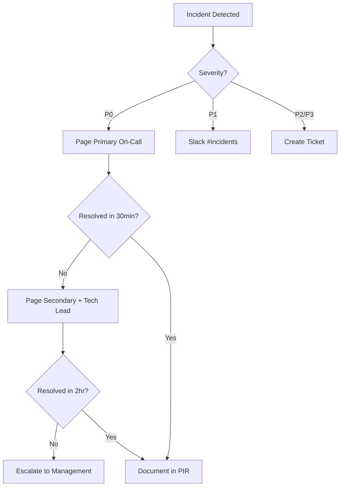

# Incident Response Runbook

> **Version**: 1.0.0  
> **Last Updated**: 2025-12-17

---

## On-Call Contacts

| Role | Name | Phone | Email |
|------|------|-------|-------|
| Primary | TBD | TBD | TBD |
| Secondary | TBD | TBD | TBD |
| Technical Lead | TBD | TBD | TBD |

---

## Incident Severity Levels

| Level | Description | Response Time | Examples |
|-------|-------------|---------------|----------|
| **P0** | Complete outage | 15 minutes | App down, auth broken |
| **P1** | Major degradation | 1 hour | High error rate, slow queries |
| **P2** | Minor issue | 4 hours | Single feature broken |
| **P3** | Cosmetic | Next business day | UI glitch |

---

## Common Incidents

### 1. High Error Rate (Functions)

**Symptoms:**
- Firebase Console shows spike in function errors
- Users report failed actions

**Diagnostic Steps:**
```bash
# Check function logs
firebase functions:log --limit=50

# Check specific function
gcloud logging read \
  'resource.type="cloud_function" AND resource.labels.function_name="generateGreeting"' \
  --limit=50 \
  --format=json
```

**Resolution:**
1. Identify failing function from logs
2. Check for recent deployments
3. Rollback if caused by deployment:
   ```bash
   firebase deploy --only functions:<functionName>
   ```
4. If issue persists, disable function temporarily

---

### 2. Firestore Permission Denied Errors

**Symptoms:**
- Users see "Permission denied" errors
- Specific role (Staff/Leader) cannot access data

**Diagnostic Steps:**
```bash
# Check Firestore rules
firebase firestore:rules

# Review recent rule changes
git log firebase/firestore.rules

# Test rules in emulator
cd firebase && npm test
```

**Resolution:**
1. Review rules change in git history
2. Revert to last known good rules:
   ```bash
   git checkout <commit-hash> firebase/firestore.rules
   firebase deploy --only firestore:rules
   ```
3. Verify fix in production

---

### 3. Mobile App Crashes

**Symptoms:**
- Crashlytics shows crash spike
- Users report app closing unexpectedly

**Diagnostic Steps:**
1. **Crashlytics Dashboard**: Top crashes by frequency
2. **Stack Trace**: Identify crashing file/line
3. **Affected Versions**: Check if specific to new release

**Resolution:**
1. If crash rate >5%: **Halt rollout immediately**
   - Play Console → Release → Halt Rollout
2. Analyze stack trace to identify root cause
3. If blocking issue: Rollback to previous version
4. If non-critical: Push hotfix and resume rollout

---

### 4. Web Portal Down

**Symptoms:**
- Users cannot access iconnect-web
- Vercel shows deployment errors

**Diagnostic Steps:**
```bash
# Check Vercel deployment status
vercel ls

# Check recent deployments
vercel inspect <deployment-url>
```

**Resolution:**
1. **Immediate**: Rollback to last working deployment
   ```bash
   vercel rollback <previous-deployment-id>
   ```
2. Check logs for error cause
3. Fix and redeploy

---

### 5. Authentication Failures

**Symptoms:**
- Users cannot log in
- "Invalid credentials" errors

**Diagnostic Steps:**
1. **Firebase Console → Authentication**
   - Check provider status (Email/Password enabled?)
   - Review recent auth changes
2. **Check Firestore rules** for users collection
3. **Test login** with known valid account

**Resolution:**
1. If provider disabled: Re-enable in Firebase Console
2. If rules blocking: Review and fix firestore.rules
3. If user-specific: Check user record in Firestore

---

### 6. Data Loss / Corruption

**Symptoms:**
- Users report missing data
- Unexpected data values

**Diagnostic Steps:**
```bash
# Check recent Firestore writes
gcloud logging read \
  'resource.type="cloud_firestore_database" AND protoPayload.methodName="google.firestore.v1.Firestore.Write"' \
  --limit=100
```

**Resolution:**
1. **STOP**: Do not modify data further
2. Identify affected collections/documents
3. Restore from backup (if available):
   ```bash
   gcloud firestore import gs://iconnect-prod-backup/<backup-date>
   ```
4. If no backup: Manual data reconstruction

---

## Rollback Procedures

### Functions

```bash
# List deployments
gcloud functions list --regions=asia-south1

# Redeploy previous version
git checkout <previous-commit>
firebase deploy --only functions
```

### Firestore Rules

```bash
# Revert rules
git checkout <previous-commit> firebase/firestore.rules
firebase deploy --only firestore:rules
```

### Web Portal (Vercel)

```bash
# List deployments
vercel ls

# Rollback
vercel rollback <deployment-id>
```

### Mobile App

```bash
# Play Console → Release → Production
# Halt current rollout
# Promote previous version to 100%
```

---

## Communication Templates

### Internal Alert

```
🚨 INCIDENT ALERT - [P0/P1/P2]

**Issue**: [Brief description]
**Impact**: [Number of users affected / % of requests failing]
**Status**: [Investigating / Mitigating / Resolved]
**ETA**: [Expected resolution time]

**Actions Taken**:
- [Action 1]
- [Action 2]

**Next Steps**:
- [Next step]

**On-Call**: [Name]
```

### User Communication

```
We're currently experiencing technical difficulties with [feature/app].
Our team is actively working on a resolution.

Expected Resolution: [Time]
Workaround: [If available]

We apologize for the inconvenience.
```

---

## Post-Incident Review

### Template

```markdown
# Post-Incident Review - [Date]

## Incident Summary
- **Severity**: P0/P1/P2/P3
- **Duration**: [Start] to [End]
- **Impact**: [Users affected, % requests failed]

## Timeline
- [Time]: Issue detected
- [Time]: On-call engineer paged
- [Time]: Mitigation started
- [Time]: Issue resolved

## Root Cause
[Technical explanation of what caused the incident]

## Resolution
[Steps taken to resolve the incident]

## Lessons Learned
1. What went well
2. What could be improved
3. Action items (with owners)

## Action Items
- [ ] [Action 1] - Owner: [Name] - Due: [Date]
- [ ] [Action 2] - Owner: [Name] - Due: [Date]
```

---

## Escalation Path



---

## Useful Commands

### Check System Health

```bash
# Functions error rate
gcloud logging read \
  'resource.type="cloud_function" AND severity>=ERROR' \
  --limit=50 \
  --format="table(timestamp,resource.labels.function_name,textPayload)"

# Firestore query latency
gcloud logging read \
  'resource.type="cloud_firestore_database"' \
  --limit=50 \
  --format="table(timestamp,protoPayload.methodName,protoPayload.latency)"

# Active users (last hour)
# Via Firebase Analytics dashboard

# Function invocation count
gcloud monitoring timeseries list \
  --filter='metric.type="cloudfunctions.googleapis.com/function/execution_count"' \
  --interval-start-time="$(date -u -d '1 hour ago' '+%Y-%m-%dT%H:%M:%SZ')"
```

### Emergency Contacts

- **Firebase Support**: https://firebase.google.com/support
- **GCP Support**: https://cloud.google.com/support
- **Vercel Support**: https://vercel.com/support

---

## Runbook Maintenance

- **Review**: Quarterly
- **Update**: After each P0/P1 incident
- **Owner**: Technical Lead
- **Last Reviewed**: 2025-12-17
