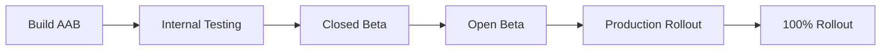

# Release & Rollout Strategy

> **Version**: 1.0.0  
> **Last Updated**: 2025-12-17

---

## Release Channels

| Channel | Audience | Update Frequency | Rollback Time |
|---------|----------|------------------|---------------|
| **Alpha** | Internal team | Daily | Immediate |
| **Beta** | Test users | Weekly | < 1 hour |
| **Production** | All users | Bi-weekly | < 4 hours |

---

## 1. Mobile App Releases

### Android Release Process



#### Step-by-Step

1. **Build Release Bundle**
   ```bash
   flutter build appbundle --release
   ```

2. **Sign with Keystore**
   ```bash
   # Keystore location: ~/.android/iconnect-release.keystore
   # Key alias: iconnect-key
   ```

3. **Upload to Play Console**
   - Go to: Play Console → Internal Testing
   - Upload AAB
   - Promote through tracks

4. **Staged Rollout**
   | Day | Rollout % | Action |
   |-----|-----------|--------|
   | 1 | 5% | Monitor crash rate |
   | 3 | 20% | Check user feedback |
   | 5 | 50% | Verify performance |
   | 7 | 100% | Full release |

### iOS Release Process

1. **Build Archive**
   ```bash
   flutter build ios --release
   # Open in Xcode: Product → Archive
   ```

2. **Upload to App Store Connect**
   - Validate → Upload to App Store

3. **TestFlight**
   - Internal Testing → External Testing

4. **App Store Submission**
   - Submit for Review
   - Release: Manual or Automatic

---

## 2. Web Portal Releases

### Vercel Deployment

| Branch | Environment | URL |
|--------|-------------|-----|
| `main` | Production | app.iconnect.app |
| `develop` | Staging | staging.iconnect.app |
| PR branches | Preview | pr-XXX.iconnect.app |

### Rollback Procedure

```bash
# Via Vercel CLI
vercel rollback [deployment-id]

# Via Dashboard
# Vercel → Deployments → Instant Rollback
```

---

## 3. Cloud Functions Releases

### Deployment Strategy

```bash
# Deploy specific function
firebase deploy --only functions:dailyScan

# Deploy all functions
firebase deploy --only functions

# Rollback (redeploy previous)
firebase deploy --only functions --force
```

### Traffic Splitting (Future)

```yaml
# firebase.json
{
  "functions": {
    "trafficSplit": {
      "dailyScan": { "v1": 90, "v2": 10 }
    }
  }
}
```

---

## 4. Rollback Procedures

### Emergency Rollback Checklist

1. **Assess Impact**
   - [ ] Check error rates in Firebase Console
   - [ ] Check user reports

2. **Execute Rollback**
   | Component | Action |
   |-----------|--------|
   | Web | Vercel instant rollback |
   | Functions | `firebase deploy --only functions` (previous version) |
   | Mobile | Staged rollout halt + previous version promotion |

3. **Communicate**
   - [ ] Update status page (if applicable)
   - [ ] Notify stakeholders

4. **Post-Mortem**
   - [ ] Document root cause
   - [ ] Update runbook

---

## 5. Release Checklist

### Pre-Release

- [ ] All tests passing (149 tests)
- [ ] Security audit complete
- [ ] Firstore rules deployed
- [ ] No console.log/debugPrint in production code
- [ ] Version bumped in `pubspec.yaml`
- [ ] CHANGELOG updated

### Post-Release

- [ ] Monitor crash analytics (24h)
- [ ] Check error rates
- [ ] Verify key user flows
- [ ] Update documentation

---

## 6. Version Numbering

**Format**: `MAJOR.MINOR.PATCH`

| Type | When | Example |
|------|------|---------|
| MAJOR | Breaking changes | 2.0.0 |
| MINOR | New features | 1.6.0 |
| PATCH | Bug fixes | 1.5.1 |

**Current Version**: 1.6.0 (Notifications + Reporting)
